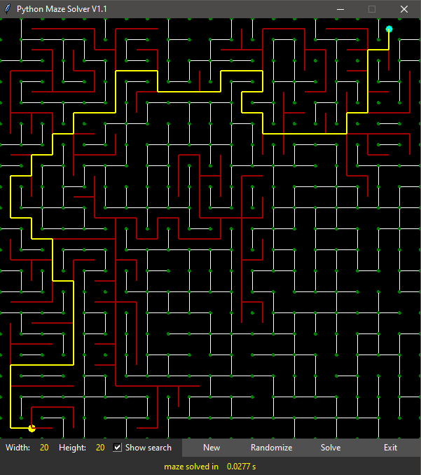

# PyMaze #
by Kai Zhu

An interactive maze generator and solver with GUI implemented in Python.

### Features ###

* Generates custom-sized mazes
* Custom placed starting and end points
* Easily add and remove maze walls by clicking on them
* BFS maze solver
* GUI

### To-do ###

* Automatically generate solution-guaranteed maze

